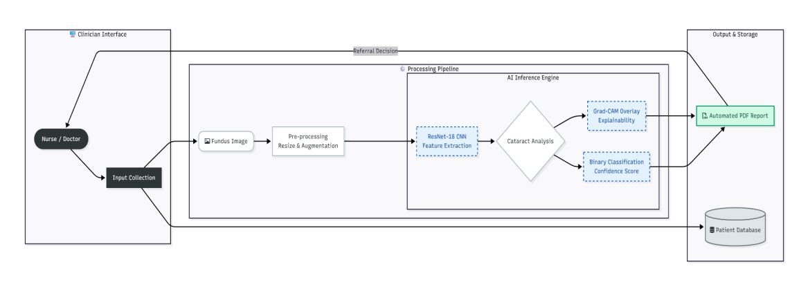

# InSight: Automated Cataract Screening System

InSight is an open-source clinical decision-support microservice that detects cataracts from ocular fundus imagery. It pairs a **ResNet-18 Convolutional Neural Network (CNN)** for binary classification with **Grad-CAM visual saliency maps** to deliver explainable, interpretable triage recommendations.

## The Clinical Challenge and Solution

Cataracts remain the leading cause of preventable blindness worldwide, disproportionately impacting regions facing severe shortages of trained ophthalmologists.

| Clinical Bottleneck | The InSight Implementation |
| :--- | :--- |
| **Delayed Diagnosis** | Automated screening enables rapid frontline patient triage by nurses and general practitioners. |
| **"Black Box" AI Skepticism** | Diagnostic predictions include Grad-CAM saliency overlays to highlight anatomical regions of interest. |
| **Non-Medical Input Errors** | A MobileNetV2 "Gatekeeper" layer intercepts and rejects non-retinal uploads before inference. |
| **Workflow Disconnect** | Provides an end-to-end Clinical Decision Support System (CDSS) complete with automated PDF reports and audit logging. |

## System Architecture

InSight separates heavy machine learning inference from the clinical presentation layer using a service-oriented architecture:

* **Presentation Layer:** Streamlit clinician dashboard providing single/batch upload queues, patient lookup, and analytics.
* **Application Layer:** Asynchronous FastAPI backend managing the MobileNetV2 gatekeeper, PyTorch ResNet-18 model, and Grad-CAM computation.
* **Data & Authentication Layer:** Supabase-managed PostgreSQL storage with Role-Based Access Control (RBAC) separating nurse and physician roles.



## Quickstart & Local Setup

Follow these steps to run the inference backend and clinical interface locally.

### Prerequisites

* Python 3.9+
* Git

### Clone the Code Repository

```bash
git clone https://github.com/nyambura-pov/InSight_Cataract_Detection.git
cd InSight_Cataract_Detection
```

### Environment Setup & Dependencies

```bash
# Create and activate virtual environment
python -m venv .venv
source .venv/bin/activate  # On Windows: .venv\Scripts\Activate.ps1

# Install requirements
pip install -r requirements.txt
```

### Configure Service Secrets

Create a `.streamlit/secrets.toml` file in the project root:

```toml
[supabase]
url = "https://your-project-id.supabase.co"
key = "your-supabase-anon-key"
```

### Launch Services

Start the FastAPI inference engine:

```bash
uvicorn backend_app:app --reload --port 8000
```

In a second terminal window, launch the clinician dashboard:

```bash
streamlit run app.py
```

Access the interface locally at `http://localhost:8501`.

## Model Performance Benchmarks

The core ResNet-18 model was trained on the ODIR-5K dataset using Focal Loss (γ = 2.0) to counteract severe class imbalance. Performance was evaluated on a held-out test split of 1,098 ocular fundus images:

| Evaluation Metric | Test Score | Clinical Significance |
| :--- | :--- | :--- |
| **Recall (Sensitivity)** | **99.40%** | Minimizes false negatives; ensures active cataract cases are flagged for specialist triage. |
| **Precision** | **99.00%** | Minimizes false positives, preventing unwarranted clinical burden on ophthalmologists. |
| **Accuracy** | **99.52%** | High baseline reliability across diagnostic categories. |
| **F1-Score** | **0.992** | Robust balance between precision and recall across skewed data distributions. |
| **AUC-ROC** | **0.998** | High diagnostic discrimination between diseased and healthy ocular states. |

## Documentation Modules

* **[Clinical Operator Guide](user-guide.md):** Step-by-step screening workflow for nurses and clinical staff.
* **[API Reference](developer-guide.md):** Complete specifications for the `POST /predict/` endpoint, request schemas, and HTTP error states.
* **Software Requirements Specification (SRS):** Detailed functional requirements, role permissions, latency targets, and compliance constraints.

## License & Operational Scope

Distributed under the MIT License.

!!! note "Operational Scope"
    InSight is architected as a Clinical Decision Support System (CDSS) for frontline triage. It is intended to assist healthcare providers and does not replace formal clinical diagnosis by a licensed ophthalmologist.