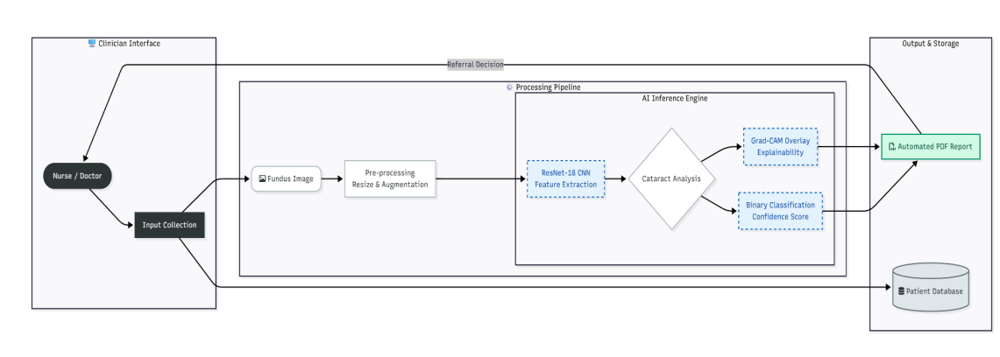

# InSight: automated cataract screening system

InSight is an open-source clinical decision support system (CDSS) that detects cataracts in ocular fundus (retinal) images. It uses a ResNet-18 convolutional neural network (CNN) for binary classification and Gradient-weighted Class Activation Mapping (Grad-CAM) saliency maps to explain each result.

## The clinical challenge and solution

Cataracts are the leading cause of preventable blindness worldwide, and they disproportionately affect regions with a shortage of trained ophthalmologists.

| Challenge | How InSight addresses it |
| :--- | :--- |
| Delayed diagnosis | Automated screening lets nurses and general practitioners triage patients at the point of care. |
| Limited trust in opaque AI | Each prediction includes a Grad-CAM overlay that highlights the image regions that influenced the result. |
| Non-medical input errors | A MobileNetV2 gatekeeper model rejects non-retinal uploads before inference. |
| Workflow disconnect | The system provides an end-to-end screening workflow with automated PDF reports and audit logging. |

## System architecture

InSight runs as a microservice and uses a service-oriented architecture to separate machine learning inference from the clinical interface:

* Presentation layer: A Streamlit dashboard for clinicians. It supports single and batch uploads, patient lookup, and analytics.
* Application layer: An asynchronous FastAPI backend that runs the MobileNetV2 gatekeeper, the PyTorch ResNet-18 model, and Grad-CAM computation.
* Data and authentication layer: Supabase-managed PostgreSQL storage with role-based access control (RBAC) that separates nurse and physician roles.



## Quickstart and local setup

To run the inference backend and the clinician dashboard locally, follow these steps.

### Prerequisites

* Python 3.9 or later
* Git

### Clone the repository

```bash
git clone https://github.com/nyambura-pov/InSight_Cataract_Detection.git
cd InSight_Cataract_Detection
```

### Create a virtual environment and install dependencies

=== "Linux / macOS"

```bash
    python3 -m venv .venv
    source .venv/bin/activate
    pip install -r requirements.txt
```

=== "Windows (PowerShell)"

```powershell
    python -m venv .venv
    .venv\Scripts\Activate.ps1
    pip install -r requirements.txt
```

### Configure credentials

Create a `.streamlit/secrets.toml` file in the project root and add your Supabase credentials:

```toml
[supabase]
url = "https://PROJECT_ID.supabase.co"
key = "SUPABASE_ANON_KEY"
```

Replace the following:

* `PROJECT_ID`: The ID of your Supabase project.
* `SUPABASE_ANON_KEY`: The anonymous (anon) public key of your Supabase project.

### Start the services

Start the FastAPI inference server:

```bash
uvicorn backend_app:app --reload --port 8000
```

In a second terminal, start the clinician dashboard:

```bash
streamlit run app.py
```

In a browser, go to `http://localhost:8501`.

## Model performance

The ResNet-18 model was trained on the Ocular Disease Intelligent Recognition (ODIR-5K) dataset. To address class imbalance, training used focal loss (γ = 2.0). The following table shows results on a held-out test split of 1,098 fundus images.

| Metric | Score | What it measures |
| :--- | :--- | :--- |
| Recall (sensitivity) | 99.40% | The proportion of cataract cases that the model correctly flags. A higher value means fewer missed cases. |
| Precision | 99.00% | The proportion of flagged cases that are true cataracts. |
| Accuracy | 99.52% | The proportion of all predictions that are correct. |
| F1 score | 0.992 | The harmonic mean of precision and recall. |
| AUC-ROC | 0.998 | How well the model separates cataract from non-cataract images across all decision thresholds. |

!!! note "Scope of these results"
    These results come from one held-out split of a single public dataset. They don't measure performance on images from other cameras, populations, or clinical settings.

## Related documentation

* [Clinical operator guide](user-guide.md): Screening workflow, Grad-CAM interpretation, and referral report export for clinical staff.
* [Developer and API guide](developer-guide.md): Specification for the `POST /predict/` endpoint, including request parameters, response schemas, database side effects, and HTTP error states.

## License and clinical use

InSight is distributed under the MIT License.

!!! warning "Clinical use disclaimer"
    InSight is a clinical decision support system (CDSS) for frontline triage. It assists healthcare providers and doesn't replace diagnosis by a licensed ophthalmologist.